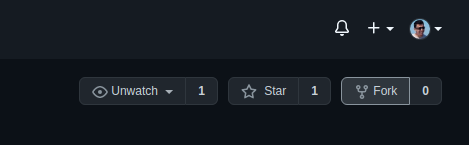
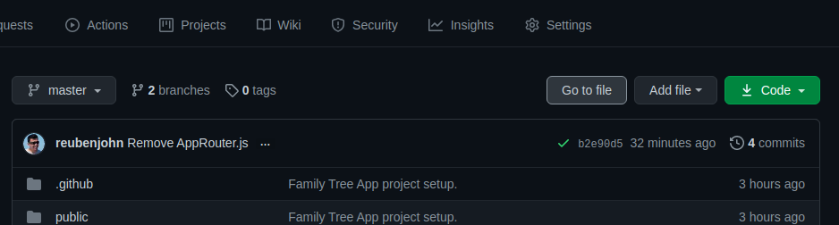
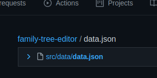
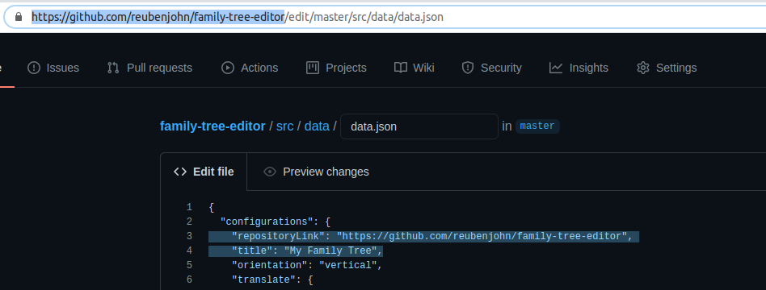
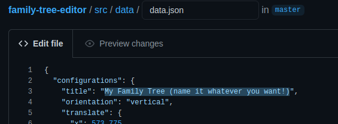
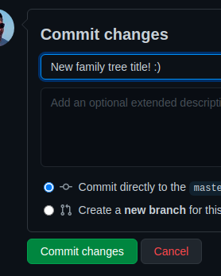
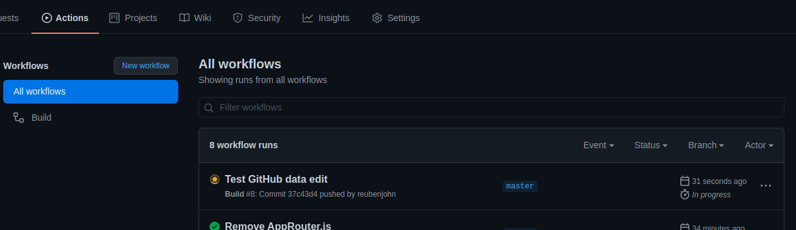
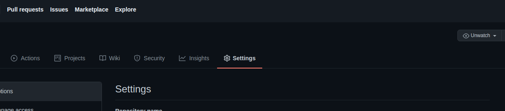
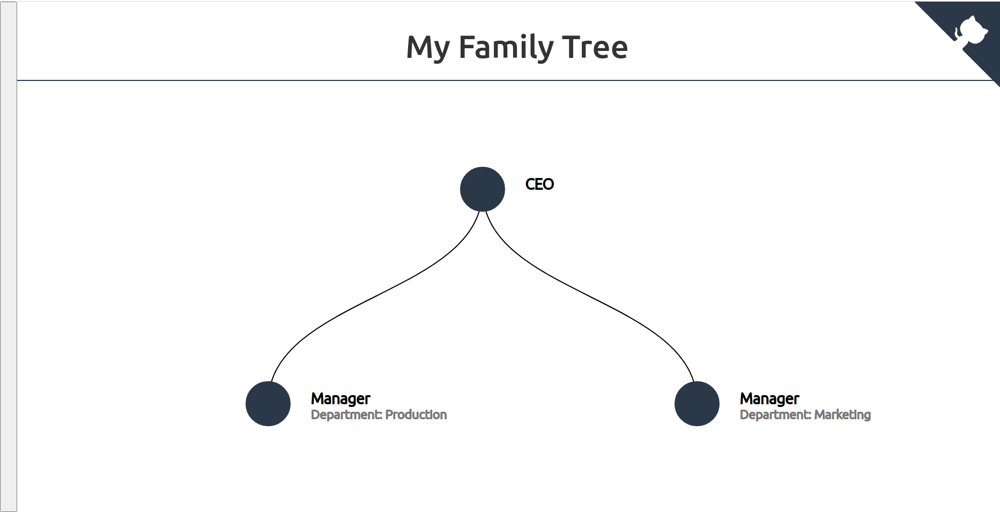
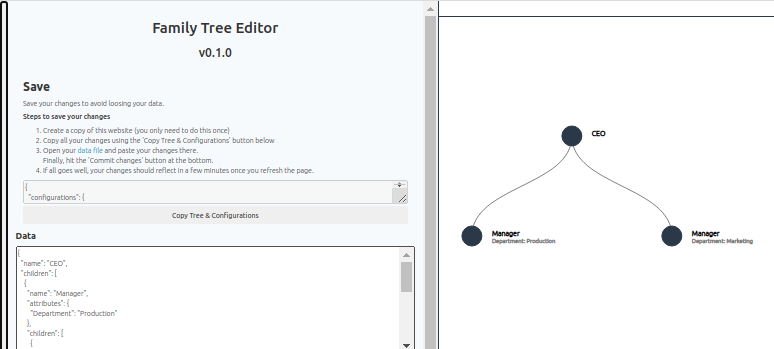

<h1 align="center">Family Tree Editor</h1>

<p align="center">
  <a href="#buildstatus">
    
  </a>
  <a href="https://github.com/prettier/prettier">
    
  </a>
</p>

<p align="center">
  <h3 align="center"><a href="https://reubenjohn.github.io/family-tree-editor">👾 Try it out now!</a></h3>
</p>

A minimalist family tree editor and viewer hosted on GitHub Pages.
It allows anyone without a technical background to create and host their family tree for free.   
It uses the [React D3 Tree library](https://github.com/bkrem/react-d3-tree) in order to generate a visual family tree from data that you input.

## Contents <!-- omit in toc -->
- [Setting up your own family tree](#setting-up-your-own-family-tree-one-time-setup)
- [Usage](#usage)
- [Development and Contributions](#development-and-contributions)

## Setting up your own family tree (one time setup)
1. Create a copy of this repository by clicking the 'Fork' button on the top right:  

2. From your newly created repository, go to a file named 'data.json' by clicking the 'Go to file' button:  

Type `data.json`:  

3. Edit the file:  
  
Let's start by also giving your family tree a `title` of your choosing:  
  
4. Describe what your changed and click 'Commit changes':  

5. This will trigger your family tree website to get generated with your latest changes!
6. Switch to the 'Actions' tab to monitor its progress: 
7. The final step is to enable your website by switching to the 'Settings' tab  
 
 and change the source branch to 'gh-page'  which should have been generated after step 6 is completed (you may have to wait a few minutes before it shows the gh-pages option):

8. If it all goes well, you will be presented with the link to your site as shown in the screenshot above.
Make sure you keep note of it! **It may take a few minutes for the link to start working.**

## Usage
The family tree launches by default in view mode.
Click the thin gray banner to the left in order to switch to edit mode:  

This exposes all the editing options  


## Development and Contributions
All the code for this website is open sourced and contributions are welcome!
If you would like to make contributions to the code, please follow the instructions below.
### Development Setup
To set up this project for local development, follow the steps below:

1. [Clone the repository](https://docs.github.com/en/github/creating-cloning-and-archiving-repositories/cloning-a-repository)
2. Install dependencies:
```bash
cd your-project-folder-name
npm i
```

> **Tip:** If you'd prefer to use your own app for development instead of the demo, simply run `npm link react-d3-tree` in your app's root folder instead of the demo's :)

### Hot reloading
Bring up the server using the below command, and changes you make will reflect live.
```bash
npm start
```
